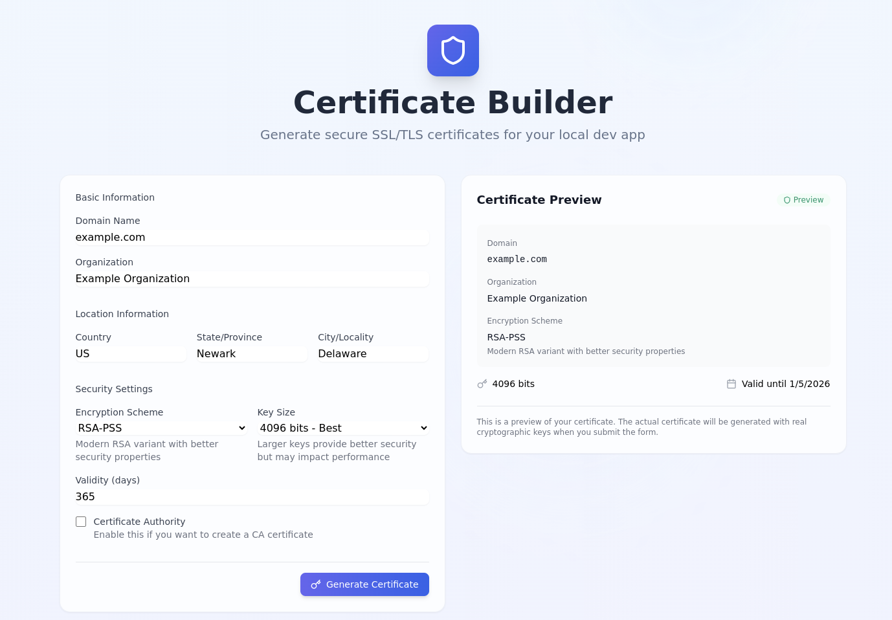
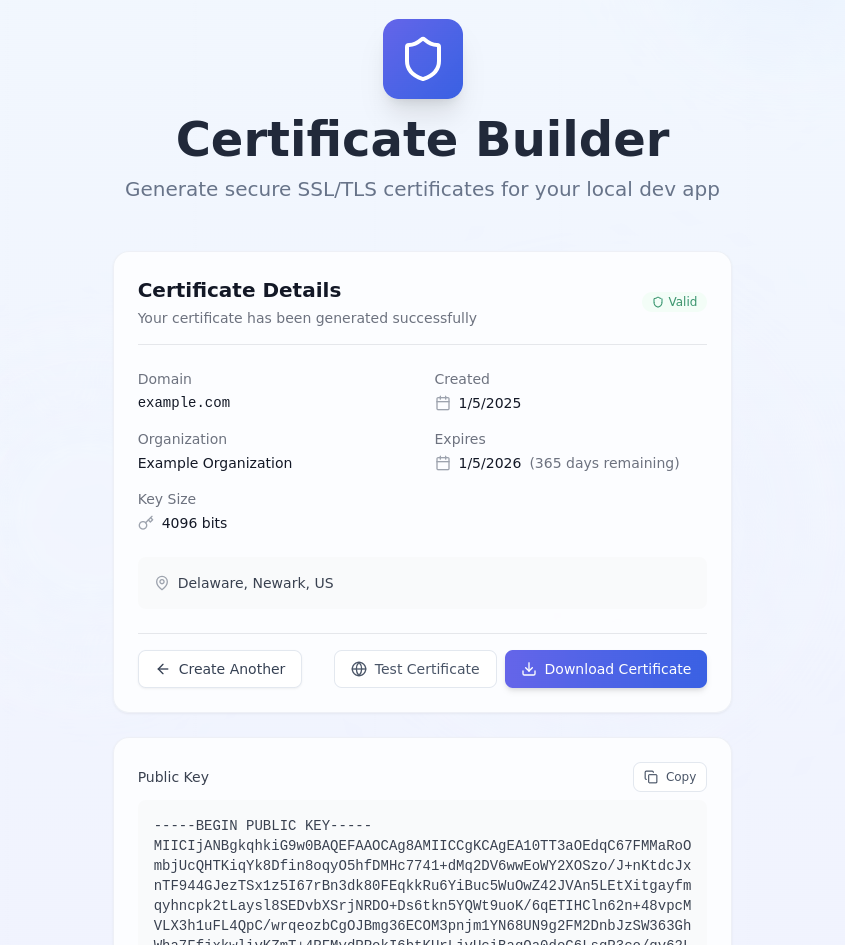

# Certificate Builder

A modern, secure SSL/TLS certificate generator for local development.

          

## Features

- Generate SSL/TLS certificates for local development
- Multiple encryption schemes (RSA-PSS, RSASSA-PKCS1-v1_5, RSA-OAEP, ECDSA)
- Configurable key sizes (2048-8192 bits)
- Mobile-responsive design
- Real-time certificate preview
- Local certificate storage
- Certificate validity testing





## Quick Start

```bash
# Install dependencies
npm install

# Start development server
npm run dev

# Build for production
npm run build
```

## Security

All cryptographic operations are performed client-side using the WebCrypto API. No sensitive data leaves your browser.

## Creator

Ed Bates (TECHBLIP LLC)

## Acknowledgments

Some sections of this code were generated with the assistance of AI tools.  These contributions were reviewed and integrated by the project creator(s).

## License

Apache-2.0 license - see the [LICENSE](LICENSE) file for details
